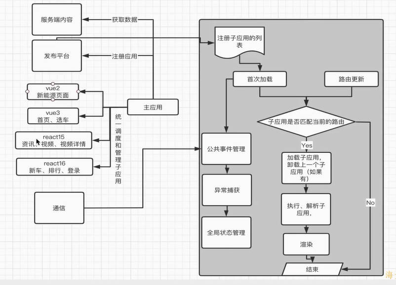

## 微前端实现方式

- iFrame
- Web Components
- 资自研框架
  - 路由分发式
  - 主应用控制路由匹配和子应用加载，共享依赖加载
  - 子应用做功能，并接入主应用实现主子控制和联动

## 框架架构图

- 1.主应用
  注册子应用
  加载、渲染子应用
  路由匹配（activeWhen，rules —— 由框架判断）
  获取数据（公共依赖，通过数据做鉴权）
  通信(父子通信，子父的通信)

- 2.子应用的功能
  渲染
  监听通信(主应用传递过来的数据，)

- 3.微前端框架
  子应用的注册
  有开始内容(应用加载完成)
  路由更新判断
  匹配对应的子应用
  加载子应用的内容
  完成所有依赖项的执行
  将子应用渲染在固定的容器内
  公共事件的管理
  异常的捕获和报错
  全局的状态管理的内容
  沙箱的隔离
  通信机制

- 4.服务端的功能
  提供数据服务

- 5.发布平台
  主子引用的打包和发布

## 架构图

